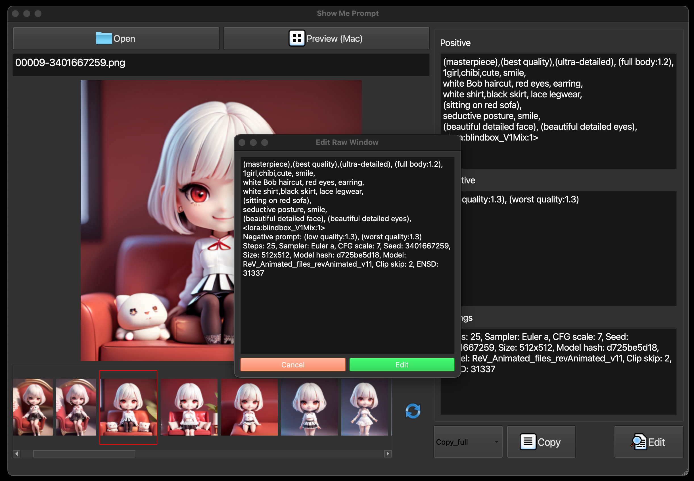
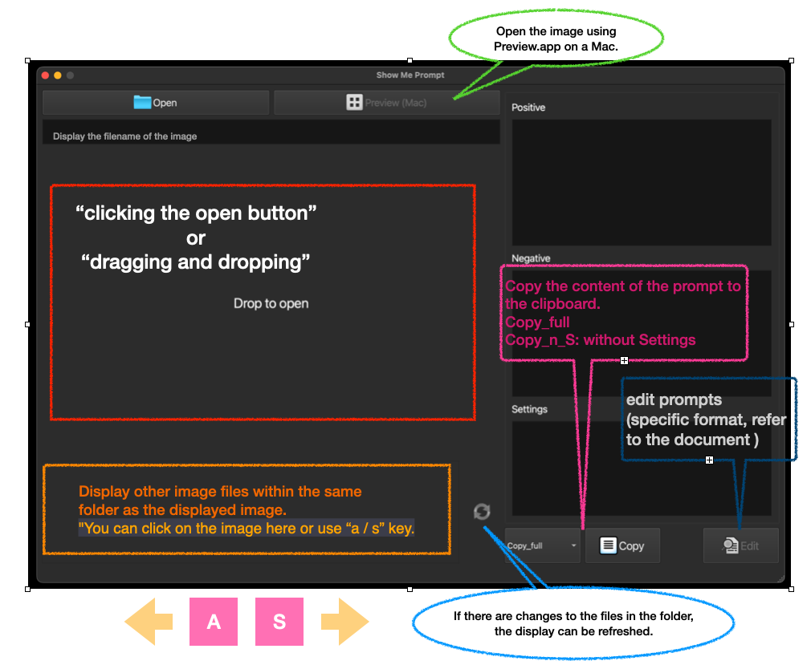

# Show Me Prompt
A simple program for displaying and editing image prompts.



## Installation
Use the git clone command to clone the repository.
```
git clone https://github.com/ChrisYangTW/ShowMePrompt.git
```
Switch to the folder where you have placed the repository,
and install the necessary dependencies.
```
pip3 install -r requirements.txt
```
Finally, run the main.py
```
python3 main.py
```

## Executable
You can use pyinstaller, py2app, py2exe to convert the code into an executable file that is compatible with the system.
If you are using the Mac M-processor series, I have already converted it using pyinstaller and placed it in [release](https://github.com/ChrisYangTW/ShowMePrompt/releases).

## Usage

* Use this program to view prompts of images downloaded from the internet or generated by using SD.
  * An image can be opened using drag-and-drop.
  * Use the 'Open' button in the top left to choose a file.
* The gallery section below will display all images in the same folder as the currently viewed image.
  * You can click on an image in the gallery section
  * Also, you can use the 'a' or 's' keys on your keyboard to select an image.
* Clicking on the 'Refresh' icon will update the content in the gallery.
  * Only need to manually click this button when images are added to the current folder.
* Editable image prompts are allowed, but they must follow a specific format.
  * Positive, Negative, and settings should be separated by an enter.(As shown in the figure below, make sure to separate these three paragraphs with an "enter" between them)
  * 
  * Also, you can simply click "Copy Generation Data" on civitai.com and paste it directly.
* Others:
  * Since I don't have a Windows to test the default program for opening images, "Preview" will be disabled on Windows system.

## Test environment
```
Python 3.11
Macbook Pro16 M1 (OS 13.3.1 (22E261))
```

## some
This is a small program for viewing image prompts.The code has many comments and also provides the original layout file (untitled_main.ui), so you can modify the code based on your own needs.
