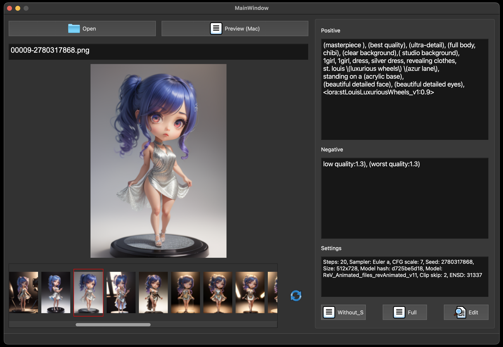

# Show Me Prompt
A simple program for displaying and editing image prompts.



## Installation
Use the git clone command to clone the repository.
```
git clone https://github.com/ChrisYangTW/ShowMePrompt.git
```
Switch to the folder where you have placed the repository,
and install the necessary dependencies.
```
pip3 install -r requirements.txt
```
Finally, run the main.py
```
python3 main.py
```

## Executable
Just use py2app or py2exe to convert it into an executable file for Mac or Windows.

## Usage

* Use this program to view prompts of images downloaded from the internet or generated by using SD.
  * An image can be opened using drag-and-drop.
  * Use the 'Open' button in the top left to choose a file.
* The gallery section below will display all images in the same folder as the currently viewed image.
  * You can click on an image in the gallery section
  * Also, you can use the 'a' or 's' keys on your keyboard to select an image.
* Clicking on the 'Refresh' icon will update the content in the gallery.
  * Only need to manually click this button when images are added to the current folder.
* Editable image prompts are allowed, but they must follow a specific format.
  * Positive, Negative, and settings should be separated by an enter.(As shown in the figure below, make sure to separate these three paragraphs with an "enter" between them)
  * 
  * Just a heads up, this feature was developed because recently the images displayed on civitai.com often lack prompts, but the uploaded images have them. So you can simply click "Copy Generation Data" on civitai.com and paste it directly.
* Others:
  * Since I don't have a Windows to test the default program for opening images, "Preview" will be disabled on Windows system.

## Test environment
```
Python 3.11
Macbook Pro16 M1 (OS 13.3.1 (22E261))
```

## some
This is a small program for viewing image prompts.The code has many comments and also provides the original layout file (untitled_main.ui), so you can modify the code based on your own needs.

## Attribution
about: openfolder.png  
<a href="https://www.flaticon.com/free-icons/folder" title="folder icons">
Folder icons created by Icongeek26 - Flaticon</a>

about: preview.png  
<a href="https://www.flaticon.com/free-icons/preview" title="preview icons">
Preview icons created by manshagraphics - Flaticon</a>

about: refresh.png  
<a href="https://www.flaticon.com/free-icons/sync" title="sync icons">
Sync icons created by SumberRejeki - Flaticon</a>

about: copy.png  
<a href="https://www.flaticon.com/free-icons/copy" title="copy icons">
Copy icons created by Icongeek26 - Flaticon</a>
