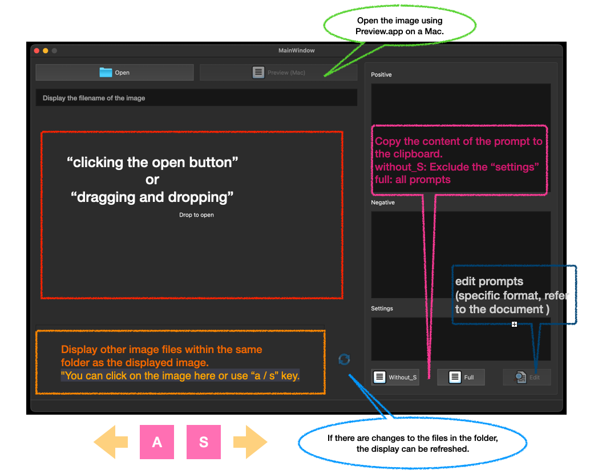

# Show Me Prompt
A simple program for displaying image prompts.


## Executable
For those using a Mac with an M-processor, you can find the executable file in the 'releases' section.
[releases]()

## Installation
Use the git clone command to clone the repository.
```
git clone https://github.com/ChrisYangTW/showmeprompt
```
Switch to the folder where you have placed the repository,
and install the necessary dependencies.
```
pip3 install -r requirements.txt
```
Finally, run the main.py
```
python3 main.py
```

## Usage


## Test environment
```
Python 3.11
Macbook Pro16 M1 (OS 13.3.1 (22E261))
```

## some
I wrote a program to view image prompts using PySide6. The code contains many comments, and the original layout's .ui file is also provided (which can be opened with Designer.app). Since I don't have a computer with a Windows system, I'm not sure if it can run properly on that platform. The Preview feature uses Mac's Preview.app. If you are using a Windows system, perhaps you can modify the program to use the default program to open images. Anyway, this is a small program that displays prompts with a simple layout and simple functions. You can modify the code based on this and use it on your own.  
我寫了一個程式，用來查看圖片的 prompt，使用 PySide6 實現。程式碼中有許多註解，也提供了原始 layout 的 .ui 檔案 (你可以用 Designer.app 開啟)。由於手邊沒有 Windows 系統的電腦，所以並不確定是否在該系統下能正常運行。預覽功能是使用 Mac 的 Preview.app，如果你使用 Windows 系統，或許你能改寫一下程式以便符合使用預設程式來開啟圖片。總之，這是一個顯示 prompt 的小程式，佈局簡單、函數簡單，你可以在這個基礎上自行修改代碼使用。

## Attribution
about: openfolder.png  
<a href="https://www.flaticon.com/free-icons/folder" title="folder icons">
Folder icons created by Icongeek26 - Flaticon</a>

about: preview.png  
<a href="https://www.flaticon.com/free-icons/preview" title="preview icons">
Preview icons created by manshagraphics - Flaticon</a>

about: refresh.png  
<a href="https://www.flaticon.com/free-icons/sync" title="sync icons">
Sync icons created by SumberRejeki - Flaticon</a>

about: copy.png  
<a href="https://www.flaticon.com/free-icons/copy" title="copy icons">
Copy icons created by Icongeek26 - Flaticon</a>